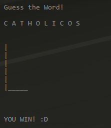
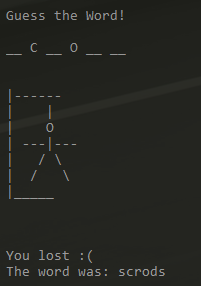
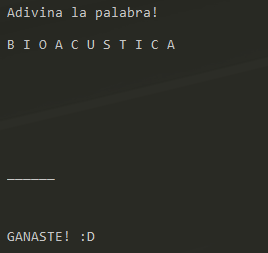
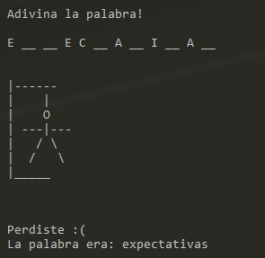

<div id="top"></div>

<!-- PROJECT LOGO -->
<br />
<div align="center">
  <h3 align="center">Hangman Game</h3>

  <p align="center">
    Basic hangman game built with Python!
    <br />
  </p>
</div>


<!-- GETTING STARTED -->
## Getting Started

### Prerequisites

* [Python](https://www.python.org/downloads/) latest version


### Testing

1. Clone the repo
   ```sh
   git clone https://github.com/sysrock18/hangman-game.git
   ```
2. Install dependencies
   ```sh
   pip install -r requirements.txt
   ```
3. Run main.py script
   ```sh
   py main.py
   ```
3. Gaming!


<!-- Screenshot -->
## Screenshots

### English

 

### Spanish
 

<!-- CONTACT -->
## Contact

Simon Gonzalez - [Linkedin](https://www.linkedin.com/in/simon-gonzalez-acosta-ing/) - gonzalezsimon18@gmail.com
